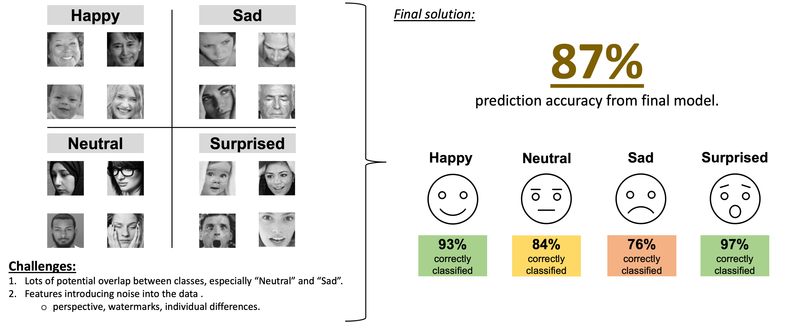

# Aspiring Data Scientist

#### Technical Skills: Python, R, SQL

## Education:
- **Professional Education in Data Science** | M.I.T | (_2024_)
    - Top 10% of all graduates.
    - Comprehnsive course covering classic machine learning, time series analysis, deep learning & neural networks, data handling & visualisation. 
- **Msc, Research Psychology** | University of Bristol | (_2019_)
    - #1 psychology graduate in 2019.
    - Published research on addressing smoker misperceptions towards e-cigarettes performing in top 5% of publihsed papers.     		

              
## Projects:

Intro: A brief summary of portfolio porjects completed. The goal of each of these porjects was to solve real world problems, beyond just demonstrating technical understanding of each technique. Each project will contain a like to the a file with the full analysis and where relevent replicable code templates. 

A summary of all projects can be seen below:

    -    Stock Portfolio Analysis using Graph based cluserting - 172% returns vs SNP500. 
    -    Emotion Dection using Convolutional Neural Networks - 87% classification accuracy.
    -    Custom Geographical Data Visulation for Agricultural farms - real world implimentation. 

----------------------------------------------------------------------
### Stock Portfolio Selection Tool - Graph Based Clustering.

Used graph based clustering to create a statistical model that can identify stock portfolio's that consistently beat market returns. Optimised and applied the model to select portfolios that on average deliver 22% returns over the last 5 years (double the 11% average in the SNP500) with 1.5x increase in risk exposure. 

[Full Project Documentation](https://drive.google.com/drive/folders/1rNQJKXx-CP3n1kz5Eh-thac_RIUyggRo?usp=sharing)

----------------------------------------------------------------------

### Facial Emotiion Detection - Convolutional Neural Networks

Used graph based clustering to create a statistical model that can identify stock portfolio's that consistently beat market returns. Optimised and applied the model to select portfolios that on average deliver 22% returns over the last 5 years (double the 11% average in the SNP500) with 1.5x increase in risk exposure. 

[Full Project Documentation](https://drive.google.com/drive/folders/1uh3j2XITl3BE34-Xk1M_EidFhqzd2Fsw?usp=sharing)

----------------------------------------------------------------------

### Custom Visualisation Tool for Agricultural Farms - Dynamic Charting

Used graph based clustering to create a statistical model that can identify stock portfolio's that consistently beat market returns. Optimised and applied the model to select portfolios that on average deliver 22% returns over the last 5 years (double the 11% average in the SNP500) with 1.5x increase in risk exposure. 

[Full Project Documentation](https://drive.google.com/drive/folders/1UTPE3cgrmZYZcGt21sS9MjdulsPND-Jf?usp=sharing)

----------------------------------------------------------------------

## Work:
**Kantar**
- relevent data science work
