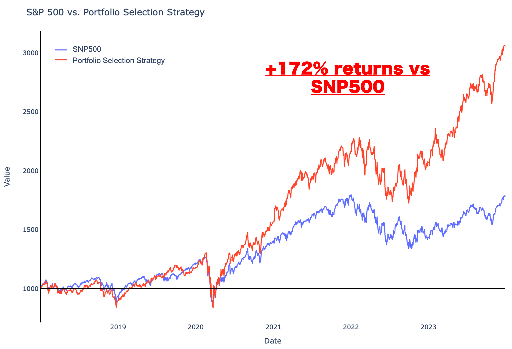
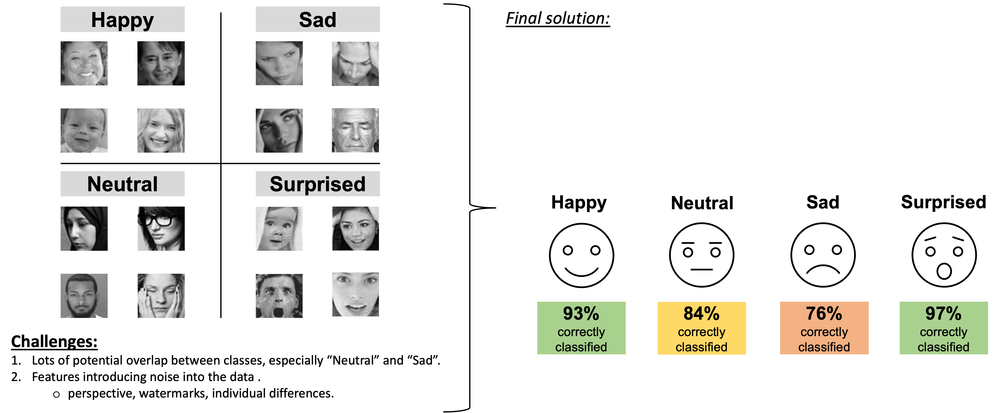

# Aspiring Data Scientist

#### Technical Skills: Python, R, SQL

## Education:
- **Professional Education in Data Science** | M.I.T | (_2024_)
    - Top 10% of all graduates.
    - Comprehnsive course covering classic machine learning, time series analysis, deep learning & neural networks, data handling & visualisation. 
- **Msc, Research Psychology** | University of Bristol | (_2019_)
    - #1 psychology graduate in 2019.
    - Published research on addressing smoker misperceptions towards e-cigarettes performing in top 5% of publihsed papers.     		

              
## Projects:
### Stock Portfolio Selection Tool - Graph Based Clustering.

Used graph based clustering to create a statistical model that can identify stock portfolio's that consistently beat market returns. Optimised and applied the model to select portfolios that on average deliver 22% returns over the last 5 years (double the 11% average in the SNP500) with 1.5x increase in risk exposure. 

--- Insert link to google drive file with code and template ---

### Facial Emotiion Detection - Convolutional Neural Networks

Used graph based clustering to create a statistical model that can identify stock portfolio's that consistently beat market returns. Optimised and applied the model to select portfolios that on average deliver 22% returns over the last 5 years (double the 11% average in the SNP500) with 1.5x increase in risk exposure. 

--- Insert link to google drive file with code and template ---

### Custom Visualisation Tool for Agricultural Farms - Dynamic Charting

Used graph based clustering to create a statistical model that can identify stock portfolio's that consistently beat market returns. Optimised and applied the model to select portfolios that on average deliver 22% returns over the last 5 years (double the 11% average in the SNP500) with 1.5x increase in risk exposure. 

--- Insert link to google drive file with code and template ---

## Work:
**Data Scientist @ Toyota Financial Services (_June 2022 - Present_)**
- Uncovered and corrected missing step in production data pipeline which impacted over 70% of active accounts
- Redeveloped loan originations model which resulted in 50% improvement in model performance and saving 1 million dollars in potential losses

**Data Science Consultant @ Shawhin Talebi Ventures LLC (_December 2020 - Present_)**
- Conducted data collection, processing, and analysis for novel study evaluating the impact of over 300 biometrics variables on human performance in hyper-realistic, live-fire training scenarios
- Applied unsupervised deep learning approaches to longitudinal ICU data to discover novel sepsis sub-phenotypes

