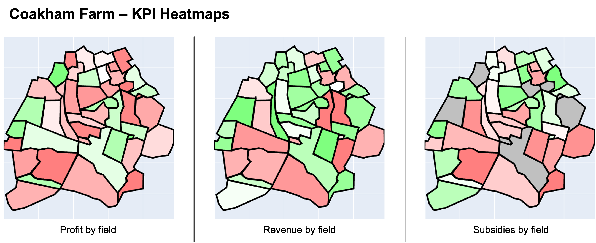

# Aspiring Data Scientist

#### Technical Skills: Python, R, SQL

## Education:
- **Professional Education in Data Science** | M.I.T | (_2024_)
    - Top 10% of all graduates.
    - Comprehnsive course covering classic machine learning, time series analysis, deep learning & neural networks, data handling & visualisation. 
- **Msc, Research Psychology** | University of Bristol | (_2019_)
    - #1 psychology graduate in 2019.
    - Published research on addressing smoker misperceptions towards e-cigarettes performing in top 5% of publihsed papers.     		

              
## Projects:

Intro:
    -    Item 1:
    -    Item 2:
    -    Item 3:
    -    Item 4: 

----------------------------------------------------------------------
### Stock Portfolio Selection Tool - Graph Based Clustering.

Used graph based clustering to create a statistical model that can identify stock portfolio's that consistently beat market returns. Optimised and applied the model to select portfolios that on average deliver 22% returns over the last 5 years (double the 11% average in the SNP500) with 1.5x increase in risk exposure. 

--- Insert link to google drive file with code and template ---

----------------------------------------------------------------------

### Facial Emotiion Detection - Convolutional Neural Networks

Used graph based clustering to create a statistical model that can identify stock portfolio's that consistently beat market returns. Optimised and applied the model to select portfolios that on average deliver 22% returns over the last 5 years (double the 11% average in the SNP500) with 1.5x increase in risk exposure. 

--- Insert link to google drive file with code and template ---

----------------------------------------------------------------------

### Custom Visualisation Tool for Agricultural Farms - Dynamic Charting

Used graph based clustering to create a statistical model that can identify stock portfolio's that consistently beat market returns. Optimised and applied the model to select portfolios that on average deliver 22% returns over the last 5 years (double the 11% average in the SNP500) with 1.5x increase in risk exposure. 

--- Insert link to google drive file with code and template ---

----------------------------------------------------------------------

## Work:
**Kantar**
- relevent data science work
